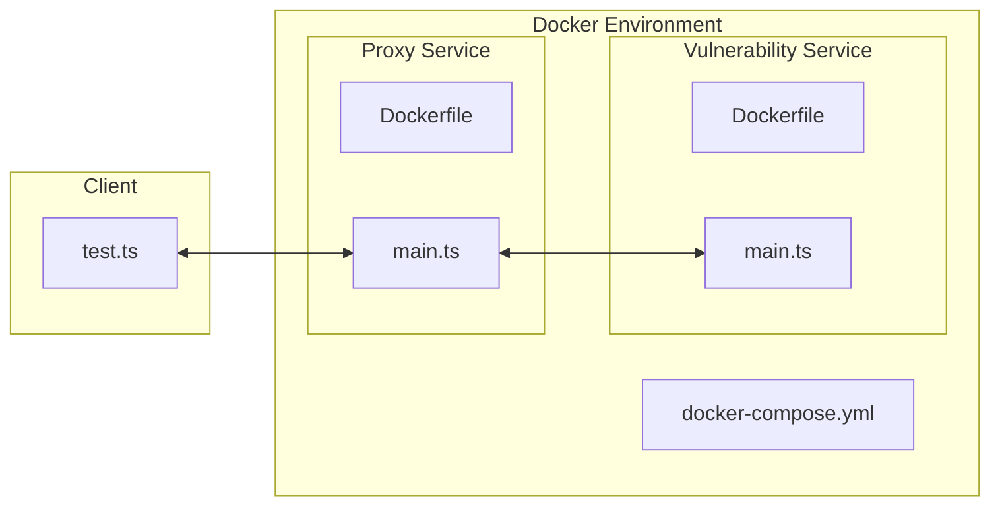

# Dynamic Challenge Instance Demo

Demo of a dynamic challenge instance module for CTFd.

## Usage

```shell
docker compose up
deno run --allow-net test.ts
```

## TODO

- [ ] Implement dynamic generation of challenge instances

## Architecture


